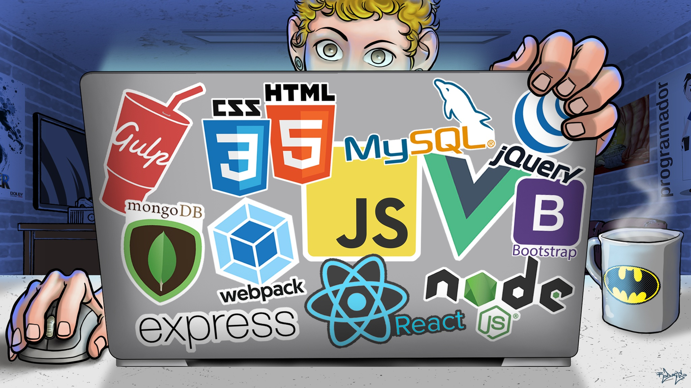

# :computer: Web Moderno

Repositório desenvolvido durante o curso de _Web Moderno Completo_ da [cod3r](https://www.cod3r.com.br/courses/web-moderno 'Link para o site do curso').

## :bookmark_tabs: Sumário

1. [:bookmark: Fundamentos de programação em JavaScript](./WebModerno/01-fundamentos)

2. [:bookmark: Estruturas de controle em JavaScript](./WebModerno/02-estruturasDeControle)

3. [:bookmark: Função](./WebModerno/03-funcao)

4. [:bookmark: Objeto](./WebModerno/04-objeto)

5. [:bookmark: Array](./WebModerno/05-array)

## :pencil: Versionamento

Eu uso [Git ](https://git-scm.com) para versionamento.

## :octocat: Autor

|                             @newtmagalhaes                              |
| :---------------------------------------------------------------------: |
|  |

## :scroll: Licença

Este projeto está licenciado sob _MIT License_ - veja o arquivo [LICENSE](./LICENSE 'Licença do repositório') para detalhes.
